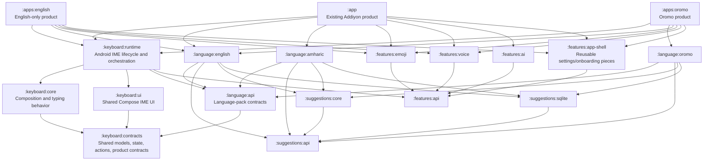

# Modular Keyboard Products and Language Packs

## Status

Implementation plan only. This document does not authorize or include production-code changes.

## Objective

Refactor the current single-module Addiyon Keyboard into a multi-module Android project that:

- preserves the existing Addiyon application, users, signing identity, IME component, behavior,
  settings, and release workflow;
- produces a separately installable English-only keyboard from the same repository;
- supports an Oromo language pack and an Oromo product without copying the keyboard engine;
- lets every product receive shared typing, cursor-safety, UI, suggestion, AI, voice, emoji, and
  platform fixes from one implementation;
- excludes an unselected language or feature from an APK by omitting its Gradle module dependency,
  rather than by deleting source files, filtering assets, or branching throughout the service;
- keeps language behavior replaceable through explicit contracts instead of growing
  `if (isAmharic)` / `when (language)` logic in shared code.

## Current-state findings

The repository is not currently modular at the language or product boundary:

- `settings.gradle.kts` includes only `:app` and `:benchmark`.
- `app/build.gradle.kts` configures application identity, signing, Firebase, Compose, dictionary
  generation, dependencies, baseline profiles, and the `/Users/dev/Sync` APK copy in one module.
- `DictionaryDbGenerator` generates both `amharic.db` and `english.db` from one task.
- `AddiyonKeyboardService.kt` is approximately 3,750 lines and owns language selection,
  composition, dictionaries, ranking, UI state, AI, voice, emoji, telemetry, and Android lifecycle.
- Language state is a Boolean (`isAmharic`), which cannot scale cleanly to Oromo or later packs.
- `KeyboardScreen` imports `AmharicLayout` and `EnglishLayout` directly and selects between them.
- English and Amharic stores, dictionaries, and n-gram models are constructed directly by the
  service.
- `app/src/main/res/xml/method.xml` is product packaging metadata but is stored beside all shared
  behavior.
- The input language, the app UI language (`AppLanguage`), and Addiyon product branding are
  partially coupled even though they are different concepts.
- The current working tree contains unrelated in-progress design/UI changes. Implementation must
  preserve and build on those changes; it must not discard, overwrite, or silently relocate them.

## Locked architectural decisions

1. **Use one repository and one Gradle build.** Do not fork the project or publish shared code to a
   second repository.
2. **Use multiple Android application modules for separately installable products.** Keep the
   existing `:app` module as the Addiyon product. Add new applications under `:apps:*`.
3. **Keep `:app` as the existing Addiyon application path.** This minimizes release, benchmark,
   command, source-history, and dirty-worktree disruption.
4. **Preserve `applicationId = "com.addiyon.keyboard"` and the existing release certificate for
   Addiyon.** New products receive unique application IDs and independent Play listings.
5. **Preserve the existing service component name
   `com.addiyon.keyboard.AddiyonKeyboardService`.** It becomes a thin product-specific subclass or
   facade over the shared runtime. Changing this component during an update may cause Android to
   treat it as a different enabled IME.
6. **Language and optional-feature exclusion is dependency-based.** If an app does not depend on
   `:language:amharic`, no Amharic transliteration implementation or dictionary assets are packaged.
7. **Use static, compile-time registries assembled by each app.** Do not use reflection, classpath
   scanning, dynamic-feature discovery, or a service locator that silently finds implementations.
8. **Do not use Play Dynamic Feature modules in the first implementation.** Language packs needed
   for an IME must be available immediately and offline. On-demand data delivery can be evaluated
   later as a separate project.
9. **Do not make product flavors the primary architecture.** Flavors may still be useful for
   environment or release differences, but product composition comes from app-module dependencies.
10. **Keep the composing layer cursor-relative.** No module extraction may introduce absolute
    document offsets or weaken the existing `TypingController` behavior contract.
11. **Separate three independent concepts:**
    - input language: the active `LanguagePack`;
    - app UI locale: English/Amharic/etc. copy used by settings and onboarding;
    - product identity: app name, icon, application ID, feature set, defaults, and brand resources.
12. **Keep shared UI compliant with `docs/DESIGN_SYSTEM.md`.** The app shell uses
    `AddiyonBrandTheme` where Addiyon branding applies; the IME uses `CustomKeyboardTheme` and
    remains fixed-height, non-scrolling at the root, and user-palette-owned.
13. **Migrate incrementally with a green build after every phase.** Do not create all modules and
    move the entire application in one change.

## Target module graph



This is the target ownership model, not a requirement to create every module in the first pull
request. The phased sequence below keeps module count proportional to the behavior already moved.

## Module responsibilities

### `:keyboard:contracts`

Use a Kotlin/JVM module where possible. It owns small, stable types used across boundaries:

- `LanguageId`, preferably a validated value class/string-backed identifier rather than an enum;
- `KeyboardLayout`, `KeyData`, `ShiftState`, `NumbersMode`, and enter-action models;
- immutable `KeyboardUiState` and `KeyboardActions` interfaces used by Compose;
- `KeyboardProduct` and product-capability types;
- neutral request/result models shared by language, suggestion, and feature contracts;
- an editor-operations interface needed by the pure composing layer.

It must not depend on Android UI, Compose, a concrete language, a product application, Retrofit,
Firebase, or SQLite.

### `:keyboard:core`

Use a Kotlin/JVM module where practical. It owns the load-bearing text-edit behavior:

- `Composition`;
- `TypingController`;
- `WordAdoption`;
- `ResumableWord`;
- composition policies such as chip-tap validation;
- sentence case and other pure input policies that are shared across languages;
- JVM test fakes for the editor-operations contract.

Introduce the smallest editor port needed by these classes. The Android `InputConnection` adapter
stays in `:keyboard:runtime`. Preserve cursor-relative operations (`setComposingText`, `commitText`,
`finishComposingText`, `deleteBeforeCursor`, and `recomposeBeforeCursor`) and do not leak an absolute
document offset into this module.

If separating `EditorGateway` from Android in one step proves too risky, first create
`:keyboard:core` as an Android library while preserving JVM unit tests, then extract the small
platform-neutral editor port in a follow-up. Behavior safety is more important than module purity.

### `:language:api`

Own the contracts that make a language installable without teaching shared code its identity.
`LanguagePack` should aggregate strategies rather than expose language-specific flags:

- stable `LanguageId` and BCP-47 locale tag;
- display metadata needed by the language selector;
- letter layout or layout factory;
- typing/composition strategy (`TypingProfile` equivalent);
- word-boundary and resumable-word policy;
- standalone punctuation transformation;
- key-corner preview policy;
- case and auto-capitalization capabilities;
- numeric-layout capabilities, such as Ge'ez numbers;
- suggestion-engine factory;
- voice locale, when voice is supported;
- telemetry category that is low-cardinality and contains no typed text;
- lifecycle hooks to load and release language-specific resources.

Do not add methods named after a concrete language, such as `isAmharic`, `amharicCandidates`, or
`supportsGeez`. Use capability or strategy names.

### `:language:english`

Own only English input behavior and assets:

- English layout configuration;
- Latin identity commit behavior;
- Latin word-boundary/case policies used by English;
- English completion and prediction engine;
- English-specific fuzzy thresholds, case restoration, and n-gram normalization;
- `english_words.dat`, `english_ngrams.dat`, generated `english.db`, and its manifest metadata;
- English language-contract and dictionary tests.

Shared Latin building blocks that Oromo also needs should move down into a neutral shared module;
Oromo must not depend on `:language:english` merely to obtain identity composition or Latin casing.

### `:language:amharic`

Own only Amharic input behavior and assets:

- `AmharicTable`, `Transliterator`, and `EthiopicNormalizer`;
- Amharic layout presentation and live corner previews;
- ranked commit transform and raw-Latin resume behavior;
- `AmharicCommitPolicy`, `AmharicPrefixCompletion`, fidel fuzzy-cost configuration, and candidate
  ranking integration;
- Ge'ez numbers capability;
- `amharic_words.dat`, `amharic_ngrams.dat`, generated `amharic.db`, and its manifest metadata;
- transliteration corpus/property tests and Amharic language-contract tests.

### `:language:oromo`

Create only after the English and Amharic extractions prove the API. It should compose shared Latin
strategies but own:

- Oromo layout and any Oromo-specific characters or long-press behavior;
- Oromo word-character and case policy;
- Oromo dictionary, n-grams, normalizer, fuzzy policy, and personal-word behavior;
- Oromo punctuation and voice locale;
- its own generated database assets and contract/golden tests.

The implementation phase must confirm the precise Oromo input specification, supported locale
variants, corpus licensing, and whether the Oromo product also includes English before building the
pack.

### `:suggestions:api`, `:suggestions:core`, and `:suggestions:sqlite`

- `:suggestions:api` owns completion/prediction requests, suggestion results, engine state, and
  lifecycle contracts.
- `:suggestions:core` owns platform-neutral algorithms such as `CandidateRanker`, `FuzzyMatcher`,
  `CasePattern`, caches, prediction identity policies, and n-gram context models.
- `:suggestions:sqlite` owns `SQLiteLanguageStore`, `SQLiteDictionary`, `SQLiteNgramModel`, asset
  installation, database failure policy, and Android threading/resource handling.

The runtime remains responsible for generation/cancellation and publishing UI state. Each language
engine remains responsible for language-specific candidate creation and ranking. Preserve the
current no-flash rule: an in-flight lookup carries the previous chip-bearing suggestion state and
does not replace it temporarily with the toolbar.

### `:keyboard:runtime`

Use an Android library. It owns behavior shared by every installed IME product:

- a reusable `BaseKeyboardService : InputMethodService`;
- Android `InputConnection` / `EditorGateway` adapter;
- session lifecycle and selection-change forwarding;
- active-language registry and switching;
- shift, number-mode, field-type, enter-action, private-field, and email-field orchestration;
- generic suggestion scheduling, cancellation, state publication, and low-memory handling;
- integration of enabled feature providers;
- construction of the shared Compose keyboard view;
- neutral hooks for opening product-owned settings or activities.

It must depend only on language/feature APIs, never on `:language:english`, `:language:amharic`,
`:language:oromo`, or a product module.

### `:keyboard:ui`

Use an Android Compose library. It owns:

- `KeyboardScreen`, key rows, key composables, keyboard metrics, suggestion UI, and IME panels that
  are truly shared;
- `CustomKeyboardTheme`, keyboard palette models, and user-themed IME design tokens;
- rendering from immutable `KeyboardUiState` plus callbacks/actions;
- generic active-language presentation and pack-supplied layouts/previews.

It must not accept `AddiyonKeyboardService` as its UI model and must not import concrete language
layouts. Replace direct service access with a narrow state/action controller whose actions fetch
the current editor connection at tap time in the runtime.

Emoji search needs a Latin query layout even in products without an English input pack. Treat that
as a neutral utility layout owned by the emoji/shared UI layer, not as a hidden dependency on
`:language:english`.

### `:features:*`

Extract optional features after the language/runtime boundary is stable:

- `:features:api`: capability and provider contracts;
- `:features:emoji`: emoji data, recent/skin-tone stores, search, panel UI, and toolbar action;
- `:features:voice`: speech-recognition orchestration, permission activity, manifest permissions,
  voice composer, recovery policies, and UI state;
- `:features:ai`: API models, Retrofit client, controller/repository, authentication UI, account
  activity integration, quota presentation, and network-security needs;
- `:features:app-shell`: reusable settings/onboarding/manual/feedback components parameterized by a
  product and brand contract.

An omitted implementation module must remove its toolbar action, code, resources, permissions, and
assets. A feature-disabled Boolean alone is not sufficient. Every rendered control must retain a
functional callback or not render, per the design-system contract.

### Application modules

#### Existing `:app` (Addiyon)

- Keep the existing application ID, signing, app/IME label, resources, backup behavior, Firebase
  identity checks, activities, debug receivers, and `AddiyonKeyboardService` FQCN.
- Assemble English and Amharic packs.
- Assemble the existing AI, voice, emoji, review, update, telemetry, settings, and feedback feature
  set unless a separate product decision changes it.
- Keep the existing timestamped `/Users/dev/Sync` APK hook.
- Continue as the initial baseline-profile benchmark target.

#### `:apps:english`

- Use a unique application ID, service class, app/IME name, icon, signing configuration, and
  `method.xml` declaring the appropriate English subtype.
- Depend on the English language pack only.
- For a single-language product, the language/globe key should invoke Android's
  `switchToNextInputMethod` behavior or use an approved single-language bottom-row policy; it must
  not display a nonfunctional internal language toggle.
- Include only explicitly selected optional features.
- Verify that Amharic input implementation classes and dictionary assets are absent from the APK.

#### `:apps:oromo`

- Use a unique application ID, service class, app/IME name, icon, signing configuration, and Oromo
  subtype metadata.
- Depend on `:language:oromo` and, if confirmed as a product requirement, `:language:english`.
- Include only explicitly selected optional features.
- Verify that Amharic input implementation classes and dictionary assets are absent.

## Core contracts to design before moving implementations

### `KeyboardProduct`

The app-owned product descriptor should define only assembly and product policy:

- product ID and default input language ID;
- ordered list of language-pack factories;
- ordered list of feature providers/capabilities;
- app-screen destination provider;
- utility layouts needed independently of input packs;
- defaults for preferences that vary by product;
- safe telemetry product identifier;
- behavior for the language key when only one pack is present.

Brand resources such as launcher icons and app labels remain Android resources in the app module.
Do not attempt to express every resource through Kotlin configuration.

### `LanguageRegistry`

The runtime-owned registry should:

- validate nonempty packs and unique stable IDs at startup;
- validate that the configured default ID exists;
- expose `activePack` rather than Boolean language state;
- switch in product-defined order;
- safely commit the outgoing composition before changing packs;
- cancel stale suggestion work and release inactive language resources using the existing
  generation guards;
- degrade a saved unknown language ID to the product default;
- support one-language products without special-casing English;
- never discover implementations reflectively.

### Typing strategy

Refactor the current `TypingProfile` into an API that preserves its useful design:

- buffer-to-commit transform;
- last-unit boundary for backspace;
- standalone-character transform;
- word-character predicate;
- caret word extraction;
- adoption policy;
- raw-input memory policy where display text differs from the buffer.

Email fields remain a field override in the runtime, not a language pack. They use a shared Latin
email profile regardless of active input language.

### Suggestion engine

Define a language-neutral engine contract covering:

- word completions for a raw/composing token;
- committed-word completions where the language permits adoption;
- next-word predictions from a bounded context;
- commit-target resolution for languages whose display differs from raw input;
- loading, ready, failure, low-memory release, and cache-clear lifecycle;
- personal-dictionary contributions keyed by language where appropriate.

Keep scheduling outside the engine so the runtime can preserve editor-token validation,
in-flight-key deduplication, stale-result rejection, and the stable suggestion-row shape.

### Feature providers

Each optional feature provider should declare:

- stable capability ID;
- toolbar action/presentation if applicable;
- runtime controller factory;
- UI panel/content contribution if applicable;
- lifecycle hooks and external activity destinations;
- whether it is available in private fields;
- required language capabilities, if any.

Avoid a generic untyped map. Use sealed, narrow contribution points for the small known set of IME
surfaces.

## Data and preference compatibility

### Active language preference

Replace `KEY_AMHARIC_MODE: Boolean` with `KEY_ACTIVE_LANGUAGE_ID: String` without losing existing
users' selection:

1. If the new key exists and names an installed pack, use it.
2. Otherwise, if the old Boolean exists, map `true -> "am-ET"` and `false -> "en-US"`.
3. Otherwise, use the product's configured default.
4. Persist the new ID after successful resolution.
5. Keep reading the old key for at least one compatibility release; remove it only after a tested
   migration window.

Use stable IDs that are not tied to Kotlin class names. If locale variants will be separate packs,
choose IDs deliberately rather than assuming every language has exactly one locale.

### Personal dictionary

The current personal dictionary is global and untagged. Introduce a versioned persistence format
before adding Oromo:

- keep email addresses in a product-global email bucket;
- tag learned language words with `LanguageId`;
- migrate existing Ethiopic-script words to Amharic and Latin words to English as a conservative
  one-time rule;
- preserve unclassifiable entries in a legacy/global bucket instead of deleting them;
- keep maximum sizes and privacy behavior bounded;
- add round-trip, old-format migration, unknown-language, and corrupted-data tests.

Distinct application IDs have distinct Android sandboxes. New English and Oromo apps will not
automatically share Addiyon preferences or learned words at runtime. Cross-app data sharing is not
part of this plan and should not be introduced through an exported provider without a separate
security/privacy design.

### Dictionary assets and generation

Move each corpus and generated database into the language module that owns it:

```text
language/english/src/main/assets/english_words.dat
language/english/src/main/assets/english_ngrams.dat
language/english/src/main/assets/english.db

language/amharic/src/main/assets/amharic_words.dat
language/amharic/src/main/assets/amharic_ngrams.dat
language/amharic/src/main/assets/amharic.db
```

Refactor `DictionaryDbGenerator` to configure one language database per task instead of assuming an
English/Amharic pair. The task should accept words, n-grams, output DB, normalization metadata, and
manifest output as properties. Register it from a language-module convention plugin. Generated DBs
remain reproducible and git-ignored according to current policy.

Avoid a shared `dictionary_manifest.properties` whose entries depend on which app is being built.
Use one manifest per language asset or a collision-safe language-prefixed manifest.

## Dependency rules and enforcement

Add a module-boundary contract test or static check enforcing:

- `:keyboard:runtime` and `:keyboard:ui` do not import `language.english`, `language.amharic`, or
  `language.oromo` implementation packages;
- language implementation modules do not depend on application modules;
- language modules do not depend on one another;
- feature implementation modules do not depend on application modules;
- optional feature implementations are referenced only from app assembly code;
- app modules contain no copied `TypingController`, `Composition`, suggestion algorithms, or shared
  key UI;
- shared modules contain no product `applicationId`, launcher icon, release signing, or Play listing
  assumptions;
- no composing module calls `setComposingRegion` or introduces absolute document offsets;
- every Android library has a unique namespace and a resource prefix where resources could collide.

Kotlin `internal` visibility is module-scoped. Before every move, list which internal declarations
cross the proposed boundary. Make the smallest intentional API public and keep implementations
internal. Do not solve compilation failures by making entire packages public or by using production
friend paths.

## Phased implementation

### Phase 0 — Baseline, safety, and product decisions

**Goal:** establish behavior and packaging evidence before file moves.

1. Resolve or checkpoint the current unrelated UI/design working-tree changes before moving their
   files. Do not reset or overwrite them.
2. Record the current Addiyon debug/release application ID, service FQCN, manifest components,
   subtype metadata, signing certificate digest, version properties, permissions, asset list, APK
   size, and database sizes.
3. Run and record the current focused and full JVM suites, `DesignSystemContractTest`, compile,
   install, and debug assembly.
4. Capture a short physical/emulator behavior baseline:
   - English composition, completion, prediction, case, email, delete, and caret resume;
   - Amharic transliteration, ranked commit, punctuation, Ge'ez numbers, suggestions, delete, and
     caret behavior;
   - language switching with a half-composed word;
   - emoji search, voice start/finish, AI panel, number/symbol modes, private fields;
   - keyboard height and suggestion-row stability.
5. Add assembly contract tests if missing for application ID, service name, permissions, assets,
   and subtype metadata.
6. Decide before Phase 9:
   - English and Oromo application IDs/names/icons;
   - signing keys and Play listings;
   - feature set for each product;
   - whether Oromo product includes English;
   - Oromo corpus/input specification and licensing;
   - independent or synchronized version numbers.

**Exit gate:** reproducible baseline and explicit record of compatibility identifiers.

### Phase 1 — Gradle convention infrastructure

**Goal:** make adding Android libraries and app products declarative without changing runtime
behavior.

1. Add Android library and Kotlin/JVM plugin aliases to `gradle/libs.versions.toml`.
2. Create an included `build-logic` build with narrowly scoped convention plugins for:
   - Kotlin/JVM libraries;
   - Android libraries;
   - Compose Android libraries;
   - Android application defaults;
   - language dictionary generation.
3. Move reusable Gradle configuration from `app/build.gradle.kts` only after equivalence tests.
   Keep product-specific application ID, Firebase identity, signing, versioning, baseline profile,
   and `/Users/dev/Sync` copy in `:app`.
4. Move or adapt `DictionaryDbGenerator` from `buildSrc` into `build-logic` after its existing output
   is byte/schema equivalent. Avoid leaving duplicate task implementations.
5. Add empty/smoke library modules only as needed by the next phase; do not create all target
   modules prematurely.
6. Add a root verification task that can run checks for every shared module and every app product.

**Verification:** compare Addiyon manifest, dependency graph, generated DB schema/metadata, and APK
contents before and after. Existing `:app:assembleDebug` output must remain behaviorally equivalent.

### Phase 2 — Extract contracts and composing core

**Goal:** establish a language-neutral engine without changing English or Amharic behavior.

1. Create `:keyboard:contracts` and move neutral layout/input/UI models.
2. Introduce the editor-operations boundary and adapt `EditorGateway` without changing its
   InputConnection safety rules.
3. Create `:keyboard:core` and move composing classes plus their focused tests.
4. Move pure policies only when all their consumers can depend in the correct direction.
5. Keep Android editor-token/surrounding-text machinery in `:keyboard:runtime` or temporarily in
   `:app` until its extraction phase.
6. Update packages/imports and explicitly expose only the API needed across modules.
7. Keep compatibility type aliases/adapters temporarily if that reduces the size of call-site
   changes; remove them after the runtime migrates.

**Verification:** all `TypingControllerTest`, composition, resumable-word, adoption, fake-editor,
chip-validation, sentence-case, and input-policy tests pass from their new owning modules. Run the
existing real-IME crash test before proceeding.

### Phase 3 — Introduce language API and registry inside the existing app

**Goal:** replace the Boolean language model while implementations still live in `:app`.

1. Create `:language:api` and implement `LanguageId`, `LanguagePack`, strategy contracts, and
   `LanguageRegistry`.
2. Add temporary `EnglishLanguagePack` and `AmharicLanguagePack` adapters that delegate to current
   classes without moving assets yet.
3. Replace `isAmharic` as the source of truth with `activeLanguageId` / `activePack`.
4. Keep a temporary derived `isAmharic` property only for staged call-site migration; prohibit new
   uses and remove it before Phase 7 exits.
5. Replace `KEY_AMHARIC_MODE` with the tested migration to `KEY_ACTIVE_LANGUAGE_ID`.
6. Generalize subtype selection policy from “selects Amharic” to “resolve language ID”, while
   preserving existing Addiyon subtype behavior during this refactor.
7. Generalize telemetry language mapping and add a bounded Oromo/other category without logging
   raw locale strings from untrusted editors.
8. Make email fields use the shared email typing override independent of active pack.

**Verification:** English/Amharic behavior parity, saved-language migration in both Boolean states,
unknown-ID fallback, one-pack registry tests, multi-pack switching tests, and session transition
tests.

### Phase 4 — Extract suggestion APIs and language-specific engines

**Goal:** remove English/Amharic ranking and database branches from the service.

1. Create `:suggestions:api`, `:suggestions:core`, and `:suggestions:sqlite` in that order.
2. Move shared algorithms and their tests without behavior changes.
3. Define `EnglishSuggestionEngine` and `AmharicSuggestionEngine` behind the shared contract while
   still allowing their assets to remain temporarily in `:app`.
4. Move completion, fuzzy, context-ranking, prediction, loading, cache, and release logic to the
   correct engine/shared owner.
5. Keep editor-token capture, request generation, cancellation, stale-result rejection, and UI
   publication in the runtime/service.
6. Preserve the `activeCompletionKey` in-flight/done deduplication behavior.
7. Version and migrate the personal dictionary to language-tagged entries.
8. Replace service fields such as `amharicDictionary`, `englishDictionary`, `amharicStore`, and
   `englishStore` with active/inactive language-session objects managed by the registry.

**Verification:** every existing suggestion test in its new module, dictionary contract/size tests,
instrumented SQLite store tests, low-memory release, toggle loading, stale result rejection, and
suggestion-row no-flash UI tests.

### Phase 5 — Extract English and Amharic language modules and assets

**Goal:** prove that an application can choose packs with Gradle dependencies.

1. Create `:language:english` and move English implementation, tests, corpora, DB output, and
   language metadata.
2. Configure per-language generation and confirm `english.db` schema/content equivalence.
3. Point `:app` at `:language:english`; verify before moving Amharic.
4. Create `:language:amharic` and move transliteration, normalization, Amharic suggestions,
   tests/corpora, DB output, and Ge'ez capabilities.
5. Point `:app` at `:language:amharic`.
6. Remove paired-language assumptions from `app/build.gradle.kts` and the old shared asset folder.
7. Add APK content assertions proving both expected packs are present in Addiyon.

**Verification:** generated assets, transliteration golden corpus/property tests, layout invariant
tests, English and Amharic suggestion suites, Addiyon install/assembly, APK Analyzer content, and
APK-size comparison with explained changes only.

### Phase 6 — Make Compose UI language- and service-neutral

**Goal:** render any pack through state and actions without importing its implementation.

1. Create `:keyboard:ui` and move shared IME UI plus `CustomKeyboardTheme`.
2. Change `KeyboardScreen(service)` to a stable state/actions/controller boundary.
3. Replace `isAmharic` UI decisions with pack presentation/capabilities:
   - active layout;
   - key corner preview provider;
   - suggestion presentation style;
   - number-layout availability;
   - language-key behavior;
   - script/case capabilities.
4. Remove direct `AmharicLayout`, `EnglishLayout`, `AmharicTable`, or concrete service imports.
5. Keep action callbacks routed through the runtime so each tap obtains the current
   `InputConnection`; do not capture a connection in Compose.
6. Preserve row count, keyboard metrics, fixed IME height, AI/emoji panel replacement height, and
   suggestion-row stability.
7. Keep the IME under `CustomKeyboardTheme` and app screens under the appropriate branded/product
   theme. Do not introduce raw colors, one-off dimensions, hard-coded app copy, or a scrolling root
   panel.
8. Split `DesignSystemContractTest` only if ownership requires it:
   - shared IME contract in `:keyboard:ui`;
   - Addiyon branded app contract in `:app` or app-shell module.
9. Update `docs/DESIGN_SYSTEM.md` and its contract test together if canonical paths, public tokens,
   theme ownership, or components change.

**Verification:** `DesignSystemContractTest`, keyboard metrics/layout tests, key UI tests,
suggestion-area UI tests, keyboard screen tests in portrait/landscape, emoji/AI height stability,
accessibility semantics, and Addiyon instrumented smoke tests.

### Phase 7 — Extract shared Android runtime and thin the Addiyon app

**Goal:** make the existing application an assembly module while preserving its Android identity.

1. Create `:keyboard:runtime` and move reusable service lifecycle/orchestration incrementally.
2. Implement `BaseKeyboardService` with abstract/app-provided `KeyboardProduct` construction.
3. Leave a thin `com.addiyon.keyboard.AddiyonKeyboardService` in `:app` that supplies Addiyon's
   product registry.
4. Keep exported service/activity declarations and product permissions in the application or
   optional feature manifests, not in a generic runtime manifest.
5. Preserve `AddiyonApp`, current activities, launcher resources, preferences filenames, backup
   rules, app/IME labels, network security, Firebase metadata, and release hooks.
6. Replace `AddiyonKeyboardView` with the shared view host while preserving lifecycle/saved-state
   ownership.
7. Remove all temporary `isAmharic` adapters and concrete language imports from runtime/UI.
8. Run the module-boundary contract test.

**Verification:** compare installed Addiyon component names with the Phase 0 baseline, update over
an existing debug installation without losing enabled-IME state where the platform permits, run
real input sessions in multiple editors, and execute full JVM/instrumented/build/install/assemble
gates.

### Phase 8 — Extract optional features

**Goal:** make non-language functionality reusable and physically omittable.

Extract one feature per change, preferably in this order:

1. emoji (self-contained data/UI/store boundary);
2. voice (permission, recognizer lifecycle, and locale integration);
3. AI (network/auth/quota/app-screen boundary and backend contract);
4. app shell/settings/manual/feedback;
5. telemetry/review/update where product differences justify extraction.

For each feature:

- introduce its narrow API/provider first;
- move implementation and tests;
- move manifest permissions/components/resources with it where safe;
- register it in Addiyon app assembly;
- prove Addiyon parity;
- add a sample/minimal assembly test that omits it and confirms absence;
- keep AI API request/response/auth/quota contracts unchanged unless coordinated with
  `/Users/dev/code/textrevamp/server` first.

**Verification:** focused tests, merged-manifest diff, APK content/permission diff, toolbar action
presence when installed and absence when omitted, private-field restrictions, and design-system
contracts.

### Phase 9 — Add the English-only application

**Goal:** produce the first independent product and prove real plug-in/plug-out behavior.

1. Create `:apps:english` with its approved namespace/application ID and resources.
2. Add a thin product service subclass with a unique FQCN.
3. Provide English `method.xml`, app/IME label, launcher icons, theme resources, backup rules, and
   selected feature providers.
4. Depend on `:keyboard:runtime`, `:language:english`, and selected features only.
5. Configure a single-language bottom-row policy; test Android next-IME switching.
6. Add product-specific versioning, signing validation, release tasks, and Play metadata strategy.
7. Add English app smoke/instrumented tests and an APK/AAB content contract.
8. Install Addiyon and English side by side and verify both appear distinctly in Android's IME
   picker and neither overwrites the other.
9. Use APK Analyzer or an automated ZIP/class/resource scan to prove absence of:
   - `amharic.db`, `amharic_words.dat`, and `amharic_ngrams.dat`;
   - Amharic transliteration implementation classes;
   - Ge'ez-only layout resources/capabilities;
   - unselected optional feature code, assets, and permissions.

Amharic UI localization may still be shared if explicitly selected for the English product; the
packaging assertion concerns Amharic **input implementation**, not necessarily translated app copy.

**Verification commands after implementation must use full paths and explicit app modules**, for
example `/Users/dev/code/addiyon-keyboard/gradlew :apps:english:assembleDebug` and
`/Users/dev/code/addiyon-keyboard/gradlew :apps:english:installDebug`.

### Phase 10 — Add Oromo pack and product

**Goal:** prove the language API supports a third language without shared-code language branches.

1. Finalize Oromo input specification, layout, locales, dictionary/ngram sources, normalization,
   licensing, fuzzy policy, voice locale, and English coexistence decision.
2. Create `:language:oromo` from the language API, composing shared Latin strategies rather than
   copying English code.
3. Add golden input, layout invariant, dictionary contract, prediction, fuzzy, casing, punctuation,
   and performance tests.
4. Add `:apps:oromo` with approved identity and pack/feature registry.
5. Add Oromo subtype metadata and subtype-to-language resolution tests.
6. Install Oromo, English, and Addiyon together and test Android IME switching.
7. Assert the Oromo APK contains only its configured packs and features.
8. Add a module-boundary regression proving Oromo required no Oromo branch in `:keyboard:runtime`
   or `:keyboard:ui`.

**Exit gate:** adding a future language requires a new `:language:<id>` module, assets/tests, and an
app dependency/registry entry, with no edits to core typing or shared UI unless the new language
requires a genuinely reusable capability.

### Phase 11 — CI, benchmarks, and release hardening

1. Keep `:benchmark` targeting `:app` initially so Addiyon baseline profiles remain stable.
2. Add English/Oromo macrobenchmark modules only if their startup or journey differs materially;
   do not multiply benchmark modules without a measured need.
3. Add CI jobs for:
   - shared-module unit tests;
   - Addiyon unit/instrumented/assembly checks;
   - English unit/smoke/assembly checks;
   - Oromo checks when implemented;
   - module-boundary and design-system contracts;
   - dictionary generation reproducibility;
   - APK content and merged-manifest assertions;
   - `git diff --check`.
4. Add an aggregate root task, such as `checkKeyboardProducts`, that depends on every product's
   required verification without installing every app.
5. Update `AGENTS.md`, developer docs, PR template, and release checklists with full-path commands.
   Once multiple apps exist, use explicit `:app:installDebug` for Addiyon so a root `installDebug`
   cannot accidentally install every application module.
6. Preserve the Addiyon-only `/Users/dev/Sync` timestamped APK output. Give new products explicit,
   distinguishable artifact names if they later use the same destination.
7. Track APK/AAB size per product so a dependency mistake that pulls Amharic or AI into a minimal
   app is visible in CI.

## Test ownership after extraction

| Test category | Target owner |
| --- | --- |
| Composition, cursor movement, adoption, rich-editor behavior | `:keyboard:core` |
| Android `InputConnection`, service lifecycle, editor tokens | `:keyboard:runtime` |
| Shared keyboard metrics, key rendering, suggestion-row height | `:keyboard:ui` |
| Candidate ranking/fuzzy/case/cache algorithms | `:suggestions:core` |
| SQLite install/query/release/failure behavior | `:suggestions:sqlite` |
| English completion/prediction/casing and dictionary assets | `:language:english` |
| Amharic transliteration/commit/completion and dictionary assets | `:language:amharic` |
| Oromo input/suggestions/assets | `:language:oromo` |
| AI, voice, emoji behavior | respective `:features:*` module |
| Manifest, subtype, application ID, permissions, packaged assets | each app module |
| Existing Addiyon cross-feature journeys and baseline profile | `:app` / `:benchmark` |

Keep focused tests beside their owner. Keep only true cross-module assembly/integration tests in an
application module.

## Verification matrix per migration phase

Every code-moving phase should perform, in proportion to its affected modules:

1. focused unit tests for moved behavior;
2. all shared module checks;
3. all Addiyon JVM tests;
4. `DesignSystemContractTest` after any UI/resource path change;
5. compile of all application debug variants;
6. Addiyon emulator installation and behavioral smoke test;
7. timestamped Addiyon APK assembly;
8. merged-manifest comparison when components/permissions move;
9. APK content and size comparison when assets/dependencies move;
10. `git diff --check`.

After new app modules exist, also assemble each product on every shared-runtime or shared-UI change.
Install each product when its assembly, manifest, service, subtype, or runtime wiring changes.

## Compatibility and rollout safeguards

- Never change Addiyon's application ID, release key, or existing service FQCN during this
  migration.
- Do not change Addiyon's `method.xml` subtype behavior in the same change that extracts modules.
  Any subtype expansion should be a separate, user-visible change with migration testing.
- Keep existing preference filenames and backup rules in Addiyon.
- Preserve the current default language and exact handling of an in-flight composition during
  language/mode changes.
- Preserve low-RAM lazy loading: only active language databases should be open, and inactive packs
  must be releasable.
- Preserve private-field restrictions and ensure optional modules cannot bypass them.
- Preserve telemetry sanitization and use stable bounded language/product categories.
- Do not alter the TextRevamp backend/API contract as part of module movement.
- Compare R8 rules after each Android library extraction. Consumer rules belong with the library
  that needs them; release minification remains enabled by the app.
- Watch manifest merging carefully. Exported IME services and launcher activities belong to app
  manifests; reusable libraries should not accidentally add exported components.
- Use collision-safe asset and resource names. Android library assets/resources merge into the app.
- Keep every intermediate commit buildable and reversible by reverting that phase, without a data
  downgrade that destroys user preferences.

## Risks and mitigations

### Large service decomposition

**Risk:** moving language logic and Android lifecycle simultaneously makes regressions difficult to
localize.

**Mitigation:** introduce contracts/adapters inside `:app`, then move implementations, then move the
runtime. Never combine all three operations in one phase.

### Kotlin visibility breakage

**Risk:** the existing single module relies heavily on `internal`; extraction can encourage an
oversized public API.

**Mitigation:** inventory callers, design narrow interfaces, expose immutable models, and enforce
module boundaries. Keep implementation classes internal to their new owner.

### IME component identity loss

**Risk:** changing the Addiyon service FQCN can disable or duplicate the keyboard for existing
users.

**Mitigation:** retain `com.addiyon.keyboard.AddiyonKeyboardService` as the app-owned facade and add
an assembly contract test for its manifest name.

### Preference/data loss

**Risk:** Boolean language state and global personal words do not map directly to multiple packs.

**Mitigation:** versioned, one-way-compatible migrations with corrupted/unknown-input tests and a
legacy fallback window.

### Hidden dependencies pull excluded code into products

**Risk:** shared runtime/UI accidentally imports Amharic or an optional feature, causing it to be
packaged everywhere.

**Mitigation:** dependency rules, source import checks, Gradle dependency inspection, and APK
content/size assertions for every product.

### Resource and manifest collisions

**Risk:** Android library resources and manifests merge globally.

**Mitigation:** unique namespaces, resource prefixes, language-prefixed assets, app-owned exported
components, and merged-manifest tests.

### Build-time regression

**Risk:** excessive fine-grained modules or global `buildSrc` invalidation can slow builds.

**Mitigation:** use a small number of cohesive modules, included convention build, configuration
cache-compatible tasks, and measure clean/incremental builds at Phase 0 and Phase 11.

### UI regression during state decoupling

**Risk:** converting service reads to state/actions can resize the IME, stale-capture an editor, or
break palette/theme behavior.

**Mitigation:** preserve tap-time connection lookup, fixed-height metrics, `CustomKeyboardTheme`,
design-system tests, and portrait/landscape UI tests.

### Oromo API overfitting

**Risk:** designing the language API exclusively from English and Amharic may force Oromo-specific
branches later.

**Mitigation:** model orthogonal strategies/capabilities, implement Oromo only after two-pack
extraction, and treat any new reusable need as an API capability rather than a language check.

## Expected file groups affected

| Area | Expected changes |
| --- | --- |
| Gradle settings/build | `settings.gradle.kts`, root `build.gradle.kts`, `gradle/libs.versions.toml`, new `build-logic/`, per-module build files |
| Existing Addiyon app | `app/build.gradle.kts`, manifest/resources, thin product service/application assembly, product integration tests |
| Benchmark | `benchmark/build.gradle.kts` and target/variant assumptions |
| Core editing | `composing/*`, neutral models/policies, editor port, focused tests |
| Android runtime | `AddiyonKeyboardService.kt`, `EditorGateway.kt`, `AddiyonKeyboardView.kt`, service/session policies and tests |
| UI | `ui/KeyboardScreen.kt`, rows/keys/suggestions, UI models/actions, theme/design contracts and UI tests |
| Suggestions | `suggestion/*`, algorithm/SQLite split, engine contracts and tests |
| English | `layout/EnglishLayout.kt`, English normalization/ranking behavior, English assets/tests |
| Amharic | `layout/AmharicLayout.kt`, `transliteration/*`, Amharic suggestion policies/assets/tests |
| Optional features | `ai/*`, `voice/*`, `emoji/*`, app-screen destinations, manifests/resources/tests |
| Preferences/localization | `KeyboardPrefs`, `LanguagePrefs`, personal dictionary storage/migration, product/app UI locale separation |
| Documentation | `AGENTS.md`, `docs/DESIGN_SYSTEM.md` if paths/contracts change, PR template, release and test coverage docs |
| New products | `apps/english/*`, `language/oromo/*`, `apps/oromo/*`, product tests and release configuration |

Exact moves should be listed in each phase's implementation PR after checking the then-current
working tree; this plan intentionally avoids assuming the current unrelated UI edits have already
landed.

## Definition of done

The migration is complete when all of the following are true:

- Addiyon upgrades with the same application ID, signing certificate, IME service component,
  settings migration, and user-visible English/Amharic behavior.
- `:app` assembles from shared runtime/UI/core plus English and Amharic language modules.
- `:apps:english` assembles and installs side by side with Addiyon while depending only on the
  English input pack.
- `:language:amharic` code and dictionary assets are absent from the English APK.
- `:language:oromo` and `:apps:oromo` can be added without an Oromo branch in shared runtime/UI.
- shared cursor/composition fixes require one change in `:keyboard:core` and are exercised by every
  product build.
- shared UI fixes require one change in `:keyboard:ui` and are exercised by every selected product.
- optional feature omission removes its code, resources, permissions, toolbar control, and assets.
- every product has unique and correct manifest/subtype/application identity and can coexist on a
  device.
- all unit, instrumented, design-system, module-boundary, dictionary, packaging, and build gates
  pass.
- root documentation contains explicit full-path commands for checking, building, installing, and
  assembling each application product.

## Open questions requiring product decisions

These do not block Phases 1-7 but must be resolved before the corresponding product ships:

1. What are the public names, application IDs, icons, and Play listings for English and Oromo?
2. Will all products use the same signing key, or distinct keys with separately managed secrets?
3. Does the Oromo product include English as an internal second language?
4. Which products include AI, voice, emoji, themes, feedback, update, review, and telemetry?
5. Should English/Oromo app screens retain Addiyon branding and English/Amharic UI localization, or
   use product-specific branding/locales?
6. What Oromo corpus and n-gram sources are approved, and what licenses/distribution constraints
   apply?
7. Are product versions released independently or from one synchronized release train?
8. Is cross-app migration of learned words/settings desired? The recommended default is no because
   separate Android apps have separate sandboxes and an exported sharing mechanism adds security
   and privacy complexity.

## Recommended pull-request sequence

Keep changes reviewable and behavior-preserving:

1. Baseline/assembly contracts and Gradle conventions.
2. `:keyboard:contracts` plus pure model moves.
3. editor port and `:keyboard:core` extraction.
4. language API/registry with adapters still in `:app`.
5. suggestion API/core/SQLite extraction.
6. English language module and assets.
7. Amharic language module and assets.
8. generic `:keyboard:ui` extraction and design-contract updates.
9. shared `:keyboard:runtime` plus thin preserved Addiyon service.
10. one optional feature extraction per PR.
11. English app module and packaging verification.
12. Oromo language module.
13. Oromo app module.
14. CI, benchmark expansion where justified, and final documentation cleanup.

Do not begin the next PR until the prior exit gate is green and the Addiyon app has been installed
and smoke-tested when that phase touches runtime, UI, manifest, resources, dictionaries, or assets.
