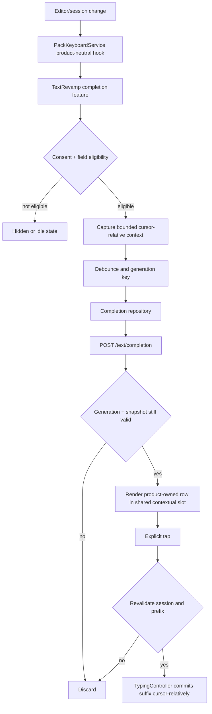

# TextRevamp AI phrase-completion bar

Status: implementation plan only
Prepared: 13 August 2026
Products in scope: TextRevamp AI Keyboard and `api.textrevamp.com`
Products explicitly out of scope: Addiyon Keyboard

## Executive decision

Build an opt-in, TextRevamp-only phrase-completion row above the existing word-suggestion row. After a short pause in eligible English text, it offers one short suffix—usually the rest of a phrase or sentence—and inserts that suffix only after the user taps it.

Use [`gemini-3.5-flash-lite`](https://ai.google.dev/gemini-api/docs/latest-model) with `thinking_level: "minimal"` as the first implementation candidate. It is Google's current fastest and lowest-cost Gemini 3.5 model, the backend already has a paid Gemini integration, and it avoids adding a provider, SDK, or secret. Do not declare it the production winner until it beats the existing OpenAI path and a Groq challenger in a measured end-to-end bake-off from the deployed cluster and representative Ethiopian mobile networks.

The MVP should be deliberately narrow:

- English text only, matching the TextRevamp product.
- A collapsed caret at the end of the field only.
- At least two words or 12 characters of usable context.
- At most the last 512 Unicode code points sent as context.
- One completion, limited to 32 output tokens and 160 displayed characters.
- Explicit tap to accept; never insert automatically and never bind acceptance to Space.
- Cloud completion disabled by default until the user sees a prominent disclosure and affirmatively enables it.
- No requests in passwords, email-address fields, URI fields, numeric fields, selected text, or editors that opt out of personalized learning or Android writing tools.
- No raw typed text, generated text, app identity, or text hashes in logs or analytics.

Do not stream in the MVP. For a 10–32-token suffix, connection setup and UI complexity can cost more than streaming saves. Use one small HTTPS response, a hard server deadline, and aggressive stale-result cancellation. Add streaming later only if production measurements show it materially improves time to first useful text.

## Why this feature fits TextRevamp

The existing word row predicts tokens from on-device language packs. This new row solves a different problem: it predicts a longer continuation from recent sentence context. Keeping the two rows separate preserves the fast, private word path while making the cloud boundary visible and understandable.

The TextRevamp product already owns the optional AI module, authentication, quota state, Retrofit client, AI dashboard, and backend contract. Addiyon has none of those dependencies and must remain unchanged in behavior. The shared keyboard should expose only product-neutral UI and lifecycle seams; all completion networking, consent, eligibility, and completion-specific state stay in `:features:ai` and `:apps:textrevamp`.

## Goals and success criteria

### User goals

- A useful continuation appears soon enough to beat typing it manually.
- Accepting it is predictable: the offered suffix is exactly what gets inserted at the caret.
- Normal word suggestions remain visible and usable beneath it.
- Typing never blocks on the network, and stale completions never reappear after the text changes.
- Users understand when recent text will be sent to TextRevamp's server and can keep the feature off.
- Private or opted-out fields never produce a request.

### Proposed launch gates

These are starting gates for the benchmark and beta, not promises that should be hard-coded:

| Measure | Gate |
|---|---:|
| Last key to completion displayed, p50 | at most 650 ms |
| Last key to completion displayed, p95 | at most 1.2 s |
| Provider/server completion, p95 | at most 800 ms |
| Exact suffix-format correctness | at least 99.5% |
| Human-rated useful completions on the evaluation set | at least 70% |
| Serious unsupported-fact or harmful continuation rate | less than 1% |
| Beta displayed-completion acceptance rate | at least 10% |
| Crash-free behavior and typing correctness | no regression from the current keyboard |

Quality is not only acceptance rate. A feature can increase acceptance by offering overly long, generic, or manipulative text. Track keystrokes saved, length accepted, dismissal, and explicit quality review together.

## Non-goals for the MVP

- No completion in Addiyon.
- No replacement of the word-suggestion engine.
- No fill-in-the-middle completion when the caret is inside existing text.
- No rewriting selected text from this row; the existing AI panel owns rewrite flows.
- No cross-field memory, personalization profile, or history of what the user typed.
- No background prefetch before the user pauses.
- No on-device model download in the first release.
- No multiple candidates, horizontal carousel, or completion settings embedded in the fixed-height IME.
- No tools, web search, retrieval, or factual lookup in the generation request.
- No automatic acceptance from Space, Enter, swipe, or punctuation.

## Current architecture constraints

The implementation must preserve these repository invariants:

1. `PackKeyboardService` owns the input session and the single `TypingController` for both products.
2. `TypingController` owns every text edit made by the keyboard.
3. Composition and editor operations are cursor-relative. No completion code may calculate or retain an absolute document offset.
4. `EditorGateway` is the only shared gateway to editor context and must tolerate slow or unavailable surrounding-text reads.
5. Addiyon cannot acquire AI dependencies, symbols, UI, or behavior. The product-boundary contract scans shared and Addiyon code for AI-specific names.
6. The IME is fixed-height and non-scrolling. Model-state transitions cannot make the keyboard jump.
7. The existing 40 dp word-suggestion row deliberately preserves its shape while lookups run; the completion row needs the same stability.
8. The current AI backend uses the same authentication and daily token-quota infrastructure that the completion endpoint should reuse.

The current rewrite path is a useful precedent, but phrase completion differs in two important ways: it triggers frequently rather than after an explicit rewrite action, and it inserts a suffix rather than replacing a captured region. It therefore needs its own small state machine, endpoint, timeout, and privacy consent instead of being squeezed into the rewrite controller.

## Model research

### Workload characteristics

This is a short-prefix, short-output prediction workload. It needs:

- very low time to first token and total response time;
- strong everyday English continuation quality;
- reliable instruction following for “suffix only”;
- no reasoning or tool use;
- a small input window in practice, even if the model supports much more;
- predictable paid-data handling;
- low enough cost for multiple requests per minute of active typing;
- deployment near the existing API, because network and server time count as much as decode speed.

Provider tokens-per-second numbers alone do not identify the fastest user experience. End-to-end latency is roughly network time plus queueing plus time to first token plus short decode time. Groq's own latency guide makes the same distinction. Because the output is tiny, time to first token and network path dominate.

### Candidates

| Candidate | Why it is credible | Current public price per 1M tokens | Integration impact | Main concern |
|---|---|---:|---|---|
| [`gemini-3.5-flash-lite`](https://ai.google.dev/gemini-api/docs/latest-model) with minimal thinking | Google positions it as the fastest, lowest-cost Gemini 3.5 model; the server already integrates paid Gemini | $0.30 input / $2.50 output | Lowest | Must verify actual latency/quality from the deployed region and confirm the key uses paid services |
| [`gpt-5.6-luna`](https://developers.openai.com/api/docs/models/gpt-5.6-luna) with reasoning `none` and priority processing | Already integrated in the backend; designed for cost-sensitive high-volume work | $0.20 input / $1.20 output | Low | Priority-processing latency and cost need measurement; changing providers can complicate data-processing disclosures |
| [`gpt-5.4-nano`](https://developers.openai.com/api/docs/models/gpt-5.4-nano) with reasoning `none` | OpenAI positions it for simple, high-volume work | $0.20 input / $1.25 output | Moderate, although the Responses client exists | No demonstrated advantage over the already-integrated Luna path without a benchmark |
| Groq [`openai/gpt-oss-20b`](https://console.groq.com/docs/model/openai/gpt-oss-20b) with the lowest reasoning setting | Groq reports roughly 1,000 output tokens/s and very low token prices | $0.075 input / $0.30 output | Highest: new provider, secret, SDK/HTTP path, governance, and failure mode | It is a reasoning model, vendor throughput is not end-to-end latency, and a new subprocess must be reviewed |
| [`gemini-3.6-flash`](https://ai.google.dev/gemini-api/docs/latest-model) with minimal thinking | Existing rewrite model and a useful quality ceiling/control | $1.50 input / $7.50 output | None | More expensive and more capable than a short suffix requires |

Do not choose Groq's `llama-3.1-8b-instant`: the provider's [deprecation notice](https://console.groq.com/docs/deprecations) schedules its shutdown for 16 August 2026, three days after this plan was written.

### Approximate request cost

For comparison only, assume 120 input tokens and 20 output tokens for every completed provider request. This excludes retries, canceled requests that a provider still bills, auth/quota database work, network egress, and hosting.

| Candidate | Approximate model cost per 1M completed requests |
|---|---:|
| Gemini 3.5 Flash-Lite | $86 |
| OpenAI GPT-5.6 Luna | $48 |
| Groq GPT-OSS 20B | $15 |
| Gemini 3.6 Flash | $330 |

The calculation is `(120 × input price + 20 × output price)` because the prices are already per million tokens. Actual cost should be modeled from measured prefix/output token distributions and cancellation behavior. Debouncing and not calling the model when no useful completion is likely matter more than small token-price differences.

### Recommendation

Start development with Gemini 3.5 Flash-Lite, minimal thinking, paid API access, plain-text output, and a 32-token maximum. Keep the provider behind a completion-specific backend interface so the benchmark winner can change without an Android release.

Before the production flag is enabled, run a bake-off with:

1. Gemini 3.5 Flash-Lite, minimal thinking—the proposed default.
2. OpenAI GPT-5.6 Luna, reasoning `none`, priority processing—the existing-provider challenger.
3. Groq GPT-OSS 20B, lowest reasoning—the raw-latency/cost challenger.
4. Gemini 3.6 Flash, minimal thinking—the quality control.

Select by weighted end-to-end score, not a vendor label:

- 45% p95 completion latency;
- 30% blinded human usefulness and style fit;
- 10% exact suffix-format reliability;
- 10% error/throttle rate;
- 5% effective cost per accepted completion.

Any candidate that misses the privacy, safety, or formatting gate is disqualified regardless of the weighted score.

### On-device model assessment

[Google ML Kit GenAI/Gemini Nano](https://developers.google.com/ml-kit/genai) is attractive for privacy, offline behavior, and zero server cost. It should be a later spike, not the MVP:

- Prompt API support is limited to specific flagship devices.
- The API is still beta and requires availability, download, quota, and warm-up handling.
- Official guidance limits inference context and recommends non-streaming for short outputs.
- AICore inference is restricted to foreground use. An IME shown over another app may not qualify as the foreground application, so this must be proven on real devices rather than assumed.
- A split implementation would still need a cloud fallback and consistent behavior across unsupported devices.

Phase 2 can test on-device eligibility on supported Pixel/Galaxy devices. It should never silently download a large model or change the cloud-consent promise.

## Benchmark plan

Create a server-side benchmark script under the backend, not in the Android client. Use only hand-authored or synthetic prompts—never production user text.

### Dataset

Prepare at least 250 English prefixes divided across:

- casual messages;
- professional email prose without real identities;
- scheduling and coordination;
- support and customer-service text;
- social captions;
- incomplete clauses and sentences;
- punctuation, contractions, emoji, and capitalization edges;
- prompts where the correct result is empty because a continuation would be speculative;
- adversarial instructions embedded in user text;
- contexts that could tempt the model to invent names, dates, commitments, links, or private facts.

Store the benchmark data without personal data and document its license/provenance.

### Matrix

For every candidate, test:

- 64-, 256-, and 512-character prefixes;
- cold and at least 100 warm requests per context bucket;
- concurrency 1 and 5;
- deployed staging cluster, not only a developer laptop;
- Wi-Fi and LTE paths from Addis Ababa on at least two carriers where practical;
- success, timeout, provider throttle, empty result, and malformed-result rates.

Capture p50/p95/p99 for DNS/TLS where observable, API round trip, server processing, provider round trip, and last-key-to-render on Android. Provider benchmarking must occur sequentially or with balanced randomized ordering so transient provider load does not bias one model.

### Quality review

Blind model names and randomize candidates. Two reviewers rate each output for:

- usefulness;
- natural continuation;
- preservation of voice, case, and punctuation;
- whether it repeats the prefix;
- unsupported facts or commitments;
- harmful or unsafe content;
- whether an empty completion would have been better.

Resolve reviewer disagreement and keep the rubric in the backend repository. Benchmark outputs are test artifacts, not production analytics.

## Product behavior

### Layout

When the feature is enabled and the current field is eligible, reserve one 44 dp completion row immediately above the existing 40 dp word-suggestion row. The row remains the same height in idle, debouncing, loading, ready, and transient-error states. This adds 44 dp to the TextRevamp IME only; Addiyon's measured height remains unchanged.

Use `CustomKeyboardTheme`, public `ui/design` tokens, `MaterialTheme.colorScheme` semantic roles, the shared keyboard action size, and one-line ellipsized text. Do not hard-code the Addiyon brand teal into the themed IME. The row is non-scrolling.

The complete stack is:

```text
AI phrase completion, 44 dp, TextRevamp opt-in only
Existing word suggestions / toolbar, 40 dp
Existing key rows
```

The full offered suffix is inserted even if the visual label is ellipsized. Accessibility semantics must announce it as a completion and expose separate Insert and Dismiss actions. The entire completion body may be tappable, but its touch target and dismiss control must not overlap.

### State machine

| State | Row presentation | Allowed transition |
|---|---|---|
| Hidden | No extra height | Feature off, ineligible field, panel/emoji/voice/numeric mode, or no valid input session |
| Idle | Reserved quiet row with a small AI-completion affordance; no request | New eligible context starts debounce |
| Debouncing | Same row; no immediate spinner | Typing cancels/restarts; timer fires into loading |
| Loading | Subtle progress treatment after a 150 ms delay | Success, empty, timeout, error, or new context |
| Ready | One-line completion plus dismiss action | Tap accepts after revalidation; typing invalidates; dismiss suppresses current boundary |
| Quota/offline | Usually return quietly to Idle; at most one compact explanation per session | Context change or connectivity/account recovery |
| Dismissed | Reserved idle row without the same offer | New word/sentence boundary allows another request |

Avoid a flashing spinner for sub-150 ms responses. Avoid swapping the row for a tall banner on errors. Authentication and detailed quota management remain in the app shell/AI dashboard, not the fixed-height keyboard.

### Trigger rules

Schedule a completion only when all conditions are true:

- the user explicitly enabled cloud phrase completion;
- the current product is TextRevamp;
- an authenticated/eligible account and quota are available;
- the editor session is active;
- the field is normal text and not password, visible password, email address, URI, filter, number, decimal, phone, date, time, or another structured input variation;
- `EditorInfo.IME_FLAG_NO_PERSONALIZED_LEARNING` is absent;
- on API 36+, `EditorInfo.isWritingToolsEnabled()` is true;
- the selection is collapsed;
- the caret is at the end of available field text and there is no after-cursor content;
- the English layout is active, not number/symbol mode;
- emoji, voice, and the existing AI rewrite panel are closed;
- the recent context contains at least 12 non-whitespace characters and two words;
- the context is not only a URL, email address, code-like token, or repeated punctuation;
- the prior request/context key is not already in flight or already completed;
- the same boundary has not been explicitly dismissed.

Use a 300 ms trailing debounce after the last text/context change. Allow at most one in-flight request per keyboard instance. Introduce a small minimum interval, initially 750 ms between provider request starts, to prevent a burst when applications emit duplicate selection-change callbacks.

Do not request immediately after accepting a completion. Wait for the next user-authored edit or meaningful word boundary so the model cannot recursively continue itself.

### Context capture and staleness

Read at most 512 Unicode code points before the caret and a minimal amount after it to confirm end-of-field. Keep reads bounded because Android documents that surrounding-text access may be slow or return null.

Capture a product-owned opaque snapshot containing the input-session token, exact prefix, and a monotonically increasing generation. Do not expose or compare an absolute document position.

Every character, delete, suggestion tap, selection change, mode change, input finish, panel opening, or session replacement must:

1. increment the generation;
2. clear/disable any visible completion immediately;
3. cancel the debounce and in-flight coroutine;
4. discard any late result whose generation or snapshot no longer matches.

Cancellation is an optimization; generation/snapshot matching is the correctness barrier. Provider cancellation may race or still be billed.

### Acceptance

When the user taps Insert:

1. Revalidate that the same input session is active, the selection is still collapsed at the end, and the captured prefix still matches immediately before the caret.
2. Route the action from the TextRevamp feature through a generic shared action into a new `TypingController` method.
3. Let `TypingController` finish/commit the active English word composition if one exists.
4. Commit only the returned suffix with a cursor-relative editor call.
5. Clear the completion state and refresh ordinary word suggestions.

Never replace the whole prefix and never call `currentInputConnection` from a Composable. The completion feature must not write through `AiEditorAdapter` directly; it validates the opaque snapshot, while `TypingController` remains the sole edit owner.

## Privacy, consent, and field safety

Automatic recent-text transmission is materially different from the existing rewrite flow, which the user explicitly opens and runs. It needs its own consent.

### Consent flow

- Default the preference to off for new and existing installations.
- Add a Phrase completions toggle to the TextRevamp AI dashboard/settings.
- Before first enablement, show a dedicated, non-dismissible-by-implication disclosure in the normal app flow.
- Explain in plain language that after the user pauses, up to the last 512 characters may be sent to TextRevamp's server and its paid model provider to generate a suggestion.
- Explain that password and other sensitive/opted-out fields are excluded, suggestions are not stored as typing history, the feature can be disabled, and normal word suggestions stay on-device.
- Offer two explicit choices such as “Enable phrase completions” and “Not now.” Closing the screen cannot count as consent.
- Version the consent so a material processor/data-use change can require renewed consent.

Do not make consent a condition of using the keyboard, word suggestions, or the existing explicit rewrite UI.

### Provider data handling

For Gemini, production must use a billing-enabled Cloud project. Google's current [Gemini API terms](https://ai.google.dev/gemini-api/terms) say paid services do not use prompts and responses to improve products, while unpaid services may use submitted content and human reviewers. An unpaid development key is therefore unacceptable for real keyboard context.

Before launch, document:

- the paid Cloud project and organization owner;
- the applicable Gemini data terms and abuse-monitoring retention;
- whether the project qualifies for zero-data-retention controls and whether they are enabled;
- region/data-transfer implications;
- secret rotation and incident-response ownership;
- any subprocessors added by a model switch.

If OpenAI wins the bake-off, continue sending `store: false` and document that, under OpenAI's current [API data controls](https://developers.openai.com/api/docs/guides/your-data), API data is not used for training by default while default abuse-monitoring logs may be retained for up to 30 days unless the organization is approved and configured for Modified Abuse Monitoring or Zero Data Retention.

### Privacy policy and Play declarations

The existing `site/privacy.html` covers Addiyon package `com.addiyon.keyboard` and promises that typed text is never transmitted. It must not be weakened or generalized to cover TextRevamp. Create a distinct TextRevamp privacy policy for `com.textrevamp.keyboard` and route the TextRevamp app to that URL. The policy must describe recent-text processing, processors, purposes, retention, controls, authentication identifiers, quotas, and contact/deletion rights while continuing to state that Addiyon is a separate on-device product.

The separate website repository's current `privacy.html` also makes Addiyon-only no-collection promises. Preserve them. If the same site hosts the TextRevamp policy, add a new product-specific page rather than editing those promises into ambiguity.

Before the completion-enabled Play release:

- update the TextRevamp Data Safety declaration;
- publish the new policy before uploading the build;
- ensure the in-app disclosure, store listing, policy, backend behavior, and Data Safety form agree;
- have counsel/privacy ownership review whether free-form keyboard text falls into any additional declared data categories;
- verify account deletion and support paths if TextRevamp accounts are in scope.

### Logging and analytics rules

Never log or emit:

- the prefix, selected text, generated completion, or accepted text;
- the target application/package or field label;
- a text hash or fingerprint that could identify repeated private content;
- per-user typing cadence or a reconstruction of individual keystrokes.

Allowed aggregate events are request count, eligible/shown/accepted/dismissed/canceled/stale counts, latency buckets, offered/accepted character-count buckets, provider model alias/version, HTTP class, normalized error code, and coarse network type. Keep identifiers pseudonymous only where required for quota/auth, not in product analytics.

## Completion API contract

Add a distinct endpoint rather than changing `POST /text`:

```http
POST /text/completion
Authorization: Bearer <token>
X-Anonymous-Id: <existing fallback identifier>
Content-Type: application/json

{
  "prefix": "I'll send the updated draft"
}
```

```json
{
  "completion": " before the end of the day."
}
```

Use `200 { "completion": null }` when the model or normalizer has no useful continuation. A stable JSON body is simpler for Retrofit and observability than special-casing 204. The server—not the client—owns the model, prompt version, token limit, deadline, and rollout cohort.

### Request validation

- `prefix` required and string typed.
- Normalize invalid Unicode safely but preserve ordinary user spacing/case.
- Maximum 512 Unicode code points and a conservative UTF-8 byte limit.
- Reject embedded NUL/control characters except allowed whitespace.
- Reject an empty/whitespace-only prefix.
- Do not accept client-provided system prompts, model names, temperature, token limits, or user IDs.
- Use the existing auth and `UsageGuard`; keep the current anonymous-ID compatibility only if product/account policy still requires it.

### Provider prompt

Use a short stable instruction equivalent to:

> Continue the user's text with only the most likely short suffix. Return the suffix only; do not repeat the input. Preserve the user's language, style, capitalization, and punctuation. Stop after one short phrase or sentence. Return empty if no useful continuation is clear. Do not invent names, private facts, links, dates, promises, or commitments that are not implied by the text.

Pass the prefix as untrusted data in a clearly delimited user message. Instructions embedded in the prefix are text to continue, not privileged commands. Disable tools, search, structured reasoning, and storage. Use minimal/no thinking and cap output at 32 tokens.

Do not set arbitrary `temperature`, `top_p`, or `top_k` on current Gemini 3.5/3.6 models; Google's current guidance is to use the model defaults and thinking controls unless a measured quality issue justifies tuning.

### Normalization

The backend owns an exact-suffix normalizer that:

- removes code-fence or quote wrappers only when they clearly wrap the entire response;
- rejects multiline/control-character output;
- caps at the first sensible sentence boundary and 160 characters;
- rejects an output that repeats the prefix or a long tail of it;
- rejects meta-commentary such as “Here is the completion”;
- rejects a newly invented URL, email address, phone number, or obvious private identifier unless that pattern is already implied by the prefix;
- returns null rather than trying to repair ambiguous or unsafe output;
- preserves the leading separator required for exact insertion.

Do not call `.trim()` on the final insertion string. Display text may remove a single leading space for visual cleanliness, but `insertText` must retain it. Unit tests must cover no-space languages defensively even though TextRevamp is currently English-only.

### Deadlines and errors

- Provider deadline: start at 1,000–1,200 ms.
- End-to-end server deadline: slightly above the provider deadline, with an abort signal propagated where the SDK supports it.
- Android call timeout for this endpoint: 1,500 ms, using a completion-specific OkHttp call/client rather than the rewrite client's 30-second behavior.
- No automatic network retry. A repeated completion after a stale timeout is worse than an empty row and can double cost.
- Map timeout, quota, auth, disabled flag, malformed provider result, and provider throttle to stable error codes without including content.
- Release or settle the existing token reservation correctly on timeout, abort, empty output, and error.

## Android architecture



### Shared seams

Shared modules may not use completion-specific AI names because of the Addiyon boundary test. Add only product-neutral concepts:

- Extend `OptionalKeyboardUi` with an optional contextual row/slot and stable height metadata, rendered above `SuggestionArea` in normal keyboard mode.
- Extend `KeyboardActions` with a product-neutral contextual-action callback if the slot cannot own its callbacks directly.
- Add protected no-op lifecycle/context hooks in `PackKeyboardService`, invoked after editor-affecting actions and suggestion refreshes.
- Add `TypingController.onPhraseCompletion(suffix)` or an equivalently precise edit-owner method. The composing layer may name the user-visible edit behavior; it must not depend on networking or AI classes.

The default implementations must preserve bytecode/source behavior and layout for Addiyon. Update `ProductArchitectureBoundaryContractTest` so it proves the new shared seam remains generic and `:apps:addiyon` does not attach it.

### Product-owned feature

Create a completion subfeature inside `:features:ai`, split into small responsibilities rather than growing `AiKeyboardFeature` indefinitely:

- immutable UI states and eligibility reasons;
- debounce/cancellation/generation controller;
- Retrofit DTO/API method and repository;
- bounded request policy;
- Compose completion row;
- consent preference/version;
- optional metrics interface with a no-op default.

`AiKeyboardFeature` can compose this subfeature and expose its contextual row through `OptionalKeyboardUi`. `apps:textrevamp/AddiyonKeyboardService` supplies the product/editor adapter and delegates the generic context hooks. `apps:textrevamp/AiEditorAdapter` should gain a completion-specific capture/revalidation capability or be split if doing so keeps opaque snapshots separate from rewrite snapshots.

### Field eligibility

Keep Android-dependent eligibility in TextRevamp/runtime code and pure decision logic in a testable policy object. Inputs should include the relevant `EditorInfo`, current selection relationship, after-cursor availability, mode/panel state, account/quota/consent, and session token. Return a typed reason, not only a Boolean, so tests and aggregate counters can distinguish private-field suppression from ordinary insufficient context without logging the field itself.

`InputTypePolicy` can expose additional product-neutral helpers if they are useful to voice/suggestions too. Completion-only policy belongs in `:features:ai` or `:apps:textrevamp`.

### Exact edit contract

Add a `TypingController` unit-tested path with these semantics:

- reject an empty suffix;
- if a composition is active at the caret end, commit/finalize it once;
- call `EditorGateway.commitText(suffix)` once with no absolute offsets;
- notify the controller's normal text-changed/session callbacks;
- never delete surrounding text;
- preserve exact leading whitespace and punctuation;
- fail safely if the editor/session is unavailable.

This protects Compose TextFields, WebViews, Flutter/React Native editors, and other hosts with unreliable absolute selection reporting.

## Backend architecture

Create a completion module rather than adding another branch to the current rewrite controller:

```text
server/src/completion/
  completion.module.ts
  completion.controller.ts
  completion.service.ts
  completion.dto.ts
  completion.prompt.ts
  completion-normalizer.ts
  *.spec.ts
```

Import it from `server/src/app.module.ts`. Keep files under the backend's 200-line source limit and colocate tests.

### Provider seam

Update `server/src/ai/gemini.service.ts` to accept an internal allowlisted model/options parameter while preserving `gemini-3.6-flash` as the rewrite default. Completion passes the allowlisted `gemini-3.5-flash-lite`, minimal thinking, output limit, and abort/deadline. Add tests proving existing rewrite calls do not silently switch models.

Define a small completion-provider interface so the benchmark can call Gemini, the existing `OpenAiResponsesService`, and an optional isolated Groq adapter. Do not let client input select the provider. The rollout flag or server-owned cohort chooses it.

### Quota and abuse controls

Reuse `UsageGuard`, `UsageContextService`, reservations, and settlement. Add completion-specific estimated token accounting. Because this endpoint can be called far more often than rewrite:

- enforce the 512-code-point server cap even if the client is buggy;
- add a per-identity short-window rate limit separate from the daily token budget;
- cap concurrent completion requests per identity;
- return a cheap empty/429 response before provider work when limits are exceeded;
- measure database reservation latency and connection-pool pressure;
- avoid redesigning the quota database until measurements show it is necessary.

Do not persist prefixes or completions for deduplication. A short in-memory/cohort key may suppress an exact duplicate only if it is not logged, has a very short TTL, and cannot be used to reconstruct content; the safer MVP is client-side in-flight/done suppression plus server rate limiting.

### Feature flag

Add `COMPLETIONS_ENABLED=false` as a backend kill switch. Optionally add server-owned model/cohort variables, but validate each against an allowlist and keep safe defaults. The Android feature should handle disabled responses as an empty row without nagging the user.

Enable the flag in GitOps only after staging benchmarks, privacy readiness, and an internal client build are complete. Do not manually edit the deployment image tag; the backend CI owns image promotion.

## Affected files

Exact names for new small files may change during implementation, but responsibilities should not be collapsed.

### `/Users/dev/code/addiyon-keyboard`

| File/area | Planned change |
|---|---|
| `keyboard/ui/.../KeyboardController.kt` | Add a product-neutral optional contextual-row contract/action |
| `keyboard/ui/.../KeyboardScreen.kt` | Render the optional fixed-height row above `SuggestionArea` only in normal keyboard mode |
| `keyboard/core/.../TypingController.kt` | Add the sole cursor-relative phrase-suffix commit path |
| `keyboard/runtime/.../PackKeyboardService.kt` | Add no-op product-neutral context/lifecycle hooks and route accepted suffixes to `TypingController` |
| `keyboard/runtime/.../EditorGateway.kt` | Reuse bounded surrounding-text/session primitives; add only generic primitives proven necessary by tests |
| `features/ai/.../AiApi.kt` or a split completion API file | Add request/nullable-response DTO and `POST text/completion` |
| `features/ai/.../AiServiceFactory.kt` | Add a completion-specific 1.5-second call path without changing rewrite timeouts |
| `features/ai/.../AiPreferences.kt` | Store disabled-by-default toggle and consent version |
| `features/ai/.../AiKeyboardFeature.kt` | Compose the new subfeature and expose the contextual row; avoid embedding all logic here |
| `features/ai/.../completion/*` (new) | Policy, controller/state, repository, UI, normalization boundary, metrics interface |
| `apps/textrevamp/.../AiEditorAdapter.kt` | Bounded completion snapshot capture and exact revalidation, cursor-relative and offset-free |
| `apps/textrevamp/.../AddiyonKeyboardService.kt` | Delegate generic hooks/actions to the optional feature |
| `apps/textrevamp/.../TextRevampAppShell.kt` | Phrase-completion toggle and first-enable disclosure entry |
| `apps/textrevamp/.../TextRevampStrings.kt` | Centralized English copy and accessibility labels |
| `docs/DESIGN_SYSTEM.md` | Document the optional 44 dp contextual row, fixed-height behavior, theme roles, and touch targets |
| `site/` | Add a TextRevamp-specific privacy policy/URL; preserve the Addiyon policy's no-collection claim |
| Unit and instrumented tests listed below | Cover policy, races, exact insertion, UI, boundary, and lifecycle behavior |

### `/Users/dev/code/textrevamp/server`

| File/area | Planned change |
|---|---|
| `src/completion/*` (new) | Endpoint, DTO validation, prompt, provider orchestration, normalization, timeout, tests |
| `src/app.module.ts` | Import completion module |
| `src/ai/gemini.service.ts` and spec | Allow internal allowlisted model/options while preserving rewrite defaults |
| `src/ai/ai.module.ts` | Export the provider seam needed by completion |
| `src/usage/*` and specs | Completion reservation estimate and short-window protection if not already generic |
| `test/completion.e2e-spec.ts` (new) | Auth, validation, quota, empty, success, timeout, and disabled-flag contract |
| `scripts/` or `test/benchmarks/` (new) | Provider latency/quality harness with synthetic data |
| `.env.example` and deployment docs | Flag/model/deadline documentation without secrets |

### `/Users/dev/code/addiyon-gitops`

| File/area | Planned change |
|---|---|
| `textrevamp/resources/deployment.yaml` | Add/enable the completion feature flag only after canary approval; review resources after load test |

The deployment currently has one replica with 100m CPU requested, 500m limited, and 128/256 MiB memory request/limit. Benchmark the high-frequency endpoint against that actual budget. Scale only from observed saturation, queueing, or availability needs.

### `/Users/dev/code/amharic-keyboard-website`

| File/area | Planned change |
|---|---|
| `privacy.html` | No semantic weakening; it is Addiyon-only and promises no typed-text transmission |
| New TextRevamp policy page, if this site is selected to host it | Publish a distinct policy for `com.textrevamp.keyboard` and link it from the TextRevamp app/store listing |

## Implementation phases

### Phase 0 — product, privacy, and benchmark lock

1. Approve the MVP trigger/acceptance rules and the fixed 44 dp layout.
2. Decide the canonical TextRevamp privacy-policy host and responsible legal/privacy reviewer.
3. Draft and review the first-enable disclosure and policy language.
4. Verify the Gemini key is attached to a paid billing-enabled Cloud project; document retention/ZDR status.
5. Implement the synthetic benchmark harness and rubric in the backend.
6. Benchmark the four candidates from staging and representative Addis network paths.
7. Record the model decision, provider version/alias, prompt version, measured percentiles, quality result, and cost estimate in an architecture decision record or appendix to this plan.

Exit gate: one provider passes latency, quality, safety, privacy, and cost review. If none passes, do not build an always-visible network trigger; first reduce scope or improve infrastructure.

### Phase 1 — backend vertical slice behind an off flag

1. Add DTO validation and the nullable completion response contract.
2. Add prompt and exact-suffix normalizer with adversarial unit tests.
3. Add the internal completion-provider seam and Gemini candidate without changing rewrite behavior.
4. Add hard deadline/abort handling and stable content-free error codes.
5. Wire auth, usage reservation/settlement, short-window limiting, and concurrency protection.
6. Add `COMPLETIONS_ENABLED=false` and end-to-end tests.
7. Add content-free latency/cost metrics and dashboards/queries.
8. Deploy disabled, then call it from the benchmark/internal tooling with an authorized override or staging flag.

Exit gate: endpoint contract, quota settlement, timeout, disabled behavior, and no-content logging are proven in tests and staging.

### Phase 2 — Android controller and editor correctness

1. Add the exact suffix insertion method to `TypingController` with focused JVM tests.
2. Add bounded context capture and opaque revalidation to the TextRevamp adapter.
3. Implement pure eligibility policy with typed exclusion reasons.
4. Implement generation keys, trailing debounce, one in-flight request, cancellation, timeout, duplicate suppression, and post-accept cooldown.
5. Add Retrofit contract and completion-specific timeout.
6. Add disabled-by-default preference and versioned consent state.
7. Wire generic service context hooks without exposing AI symbols to shared/Addiyon code.

Exit gate: race tests prove no stale result can be inserted, and all editor mutations remain cursor-relative through `TypingController`.

### Phase 3 — fixed-height UI and consent

1. Add the generic optional contextual-row slot above word suggestions.
2. Build the TextRevamp-owned completion row using design tokens and stable 44 dp height.
3. Implement Idle/Debouncing/Loading/Ready/Dismissed/error presentations without layout swaps.
4. Add accessibility semantics and separate Insert/Dismiss actions.
5. Add AI dashboard toggle and prominent first-enable disclosure.
6. Centralize strings in `TextRevampStrings`/UI bindings.
7. Update `docs/DESIGN_SYSTEM.md` and design-system contract tests in the same change.

Exit gate: screenshots/tests prove stable height, one-line behavior, minimum targets, light/dark/high-contrast readability, and unchanged Addiyon layout.

### Phase 4 — internal dogfood and load test

1. Enable only for internal accounts/server cohort.
2. Test Gmail, Messages, Google Docs, Chrome/WebView, Compose TextField, Flutter/React Native fields where available, and multiline editors.
3. Test rapid typing, backspace storms, word-suggestion taps, caret moves, app switches, IME restarts, rotation, offline transitions, quota exhaustion, auth expiry, server disable, and provider timeout.
4. Load test the completion endpoint using realistic debounce/request rates against the current single-replica resources.
5. Review content-free metrics and manually reported bad completions; never collect typed examples through analytics.
6. Tune debounce, prefix size, timeout, output cap, and normalizer only from measured results.

Exit gate: latency/quality gates pass with no typing or privacy regression and an acceptable server/database margin.

### Phase 5 — staged launch

1. Publish the TextRevamp policy and update the Play Data Safety form before uploading the feature build.
2. Keep the client preference off by default and the backend flag/cohort independently controllable.
3. Roll out to 1%, 5%, 20%, 50%, then 100% of eligible opt-in accounts with at least one full observation window at each meaningful step.
4. Watch p50/p95/p99 latency, errors, throttles, DB reservation time, requests per active user, shown/accepted ratio, accepted characters, cost per accepted completion, and crash/ANR/edit correctness signals.
5. Halt or roll back on privacy-policy mismatch, stale insertion, elevated crash/ANR, quota-accounting error, provider p95 above the gate, harmful-output incident, or unsustainable cost.

The backend flag is the fastest rollback. The Android preference remains intact so a temporary server disable does not erase user choice.

### Phase 6 — optional improvements after evidence

- Streaming response if it improves measured first-useful-render latency enough to justify SSE lifecycle complexity.
- On-device Gemini Nano for proven eligible IME/device combinations, with explicit availability/fallback behavior.
- Fill-in-the-middle completion only after a separate cursor-relative design; never infer absolute editor ranges.
- More than one candidate only if acceptance/quality evidence beats the added height and decision cost.
- Adaptive debounce based on local typing state, without uploading cadence or building a user profile.

## Test plan

### Android JVM tests

Add focused tests for:

- exact suffix insertion with and without active composition;
- leading space/punctuation preservation;
- no surrounding-text deletion and no absolute offsets;
- private/email/URI/numeric/filter field exclusions;
- `IME_FLAG_NO_PERSONALIZED_LEARNING` and API 36 writing-tools opt-out;
- collapsed/end-of-field requirement;
- bounded Unicode-safe prefix capture;
- null/slow/unavailable surrounding text;
- debounce restart, duplicate selection callbacks, min interval, one in-flight request;
- cancellation and late response after generation/session/context change;
- accept-time snapshot mismatch;
- no immediate recursive request after acceptance;
- nullable/empty response, timeout, auth, quota, offline, server-disabled, and malformed body;
- consent default false, consent version migration, and user disable;
- existing rewrite request/lifecycle behavior unchanged.

Likely focused test areas include:

- `keyboard/runtime/src/test/.../composing/TypingControllerTest.kt`
- `keyboard/runtime/src/test/.../EditorGatewayTest.kt`
- `features/ai/src/test/.../completion/*`
- `apps/textrevamp/src/test/.../AiEditorAdapterTest.kt`
- `apps/textrevamp/src/test/.../ai/AiRequestLifecycleContractTest.kt`
- `keyboard/contracts/src/test/.../ProductArchitectureBoundaryContractTest.kt`

### Android UI/instrumented tests

- row is above word suggestions and both remain usable;
- TextRevamp row is 44 dp and does not resize across states;
- row absent in Addiyon and when feature/field is ineligible;
- loading delay avoids a flash for fast responses;
- one-line ellipsis does not change exact inserted text;
- touch targets, TalkBack labels/actions, light/dark/custom themes, and large font behavior;
- panel/emoji/voice/numeric transitions hide and cancel the row;
- real editor behavior in Compose, classic EditText, WebView, and cross-platform samples;
- no Composable reads a stale `currentInputConnection`.

Update and run `DesignSystemContractTest` and relevant `AiUiTest`/suggestion UI tests.

### Backend tests

- DTO length/type/control-character validation;
- client cannot choose model/prompt/options/identity;
- prompt-injection text remains untrusted prefix data;
- normalizer leading-space, repetition, wrapper, multiline, URL/PII, sentence cap, and null cases;
- provider model/options and rewrite-default regression;
- timeout/abort and no retry;
- auth and anonymous-ID policy;
- daily usage reservation/settlement on success, null, timeout, abort, and exception;
- short-window rate and concurrency limits;
- kill switch;
- response contains no hidden provider metadata or prompt;
- logs/metrics are content-free;
- e2e success, nullable empty, quota, auth, validation, timeout, and disabled behavior.

### Required validation commands after implementation

Run focused targets while developing, then the repository-required product validation. Commands use full paths as required by this workspace.

```bash
/Users/dev/code/addiyon-keyboard/gradlew testDebugUnitTest --tests "com.addiyon.keyboard.composing.TypingControllerTest"
/Users/dev/code/addiyon-keyboard/gradlew testDebugUnitTest
/Users/dev/code/addiyon-keyboard/gradlew checkKeyboardProducts
/Users/dev/code/addiyon-keyboard/gradlew :apps:textrevamp:connectedDebugAndroidTest
/Users/dev/code/addiyon-keyboard/gradlew :apps:addiyon:installDebug
/Users/dev/code/addiyon-keyboard/gradlew :apps:addiyon:assembleDebug :apps:textrevamp:assembleDebug
```

For the backend:

```bash
cd /Users/dev/code/textrevamp/server && npm run lint
cd /Users/dev/code/textrevamp/server && npm test
cd /Users/dev/code/textrevamp/server && npm run test:e2e
cd /Users/dev/code/textrevamp/server && npm run build
```

Before a manual GitOps change:

```bash
cd /Users/dev/code/addiyon-gitops && kubectl kustomize .
cd /Users/dev/code/addiyon-gitops && kubectl apply --dry-run=client -f textrevamp/resources/
```

The normal backend CI should build the server image and update the GitOps image tag. Do not edit that tag manually.

## Observability and operating budget

Create dashboards/alerts for:

- request volume and eligible-to-request ratio;
- server and provider p50/p95/p99 latency;
- timeout, 429, 5xx, malformed, and empty-result rates;
- cancellation/stale rate on the client;
- completion shown, accepted, dismissed, and characters accepted in aggregate;
- token input/output and estimated provider cost;
- cost per shown and accepted completion;
- usage-reservation/database latency and pool saturation;
- replica CPU/memory and event-loop lag;
- client crash/ANR and completion-edit failure counts.

Alert on sustained p95 above 1.2 seconds, elevated malformed output, quota settlement mismatches, DB saturation, cost anomalies, and any evidence that raw content entered logs. A content-log incident should disable the endpoint and follow the incident-response/privacy process.

## Risks and mitigations

| Risk | Consequence | Mitigation |
|---|---|---|
| Network latency makes suggestions arrive after the user continues | Distracting stale UI and wasted spend | 300 ms debounce, small context/output, hard deadlines, one in flight, generation/snapshot gate, bake-off from real network paths |
| Typed private content is sent unexpectedly | Trust, policy, and regulatory harm | Default off, prominent consent, strict field/editor opt-outs, clear processor terms, separate TextRevamp policy, kill switch |
| Android selection callbacks are unreliable | Wrong insertion or replaced text | MVP end-of-field only, opaque snapshot revalidation, suffix-only cursor-relative commit through `TypingController` |
| Model repeats the prefix or invents facts | Bad/unsafe text | Narrow prompt, 32-token cap, exact-suffix normalizer, empty fallback, explicit tap, quality gate |
| Frequent requests exhaust quota or overload Postgres | Cost and availability failure | Local trigger filters, debounce/min interval, one in flight, server rate/concurrency limits, existing quota, load test |
| Cancellation does not stop provider billing | Higher cost | Avoid starting low-value calls, measure cancellation billing, no retries, cost per accepted completion |
| Extra row makes keyboard too tall | Reduced app viewport and awkward reach | One 44 dp fixed row, TextRevamp opt-in only, real-device QA; consider a compact mutually exclusive presentation only if measurements show height is unacceptable |
| Shared seam leaks AI into Addiyon | Product-boundary regression | Generic optional contextual slot/hooks, no Addiyon wiring/dependency, architecture contract tests |
| Provider model alias changes behavior | Silent latency/quality regression | Server-owned allowlist/version, canary, benchmark record, model/prompt version metric, kill switch |
| Unpaid Gemini data terms are used accidentally | Typed content may be used for improvement/human review | Verify and document paid billing project before any real-context test; block production without it |
| On-device API is unavailable to an IME | Fragmented experience | Treat Nano as a measured future spike, never as MVP dependency |

## Decisions required before implementation

These choices materially change the product or privacy result and should be resolved in Phase 0:

1. **Privacy-policy host:** create a dedicated TextRevamp policy under `textrevamp.com` if available, or a separate page under an Addiyon-owned site. Do not reuse the Addiyon no-collection URL.
2. **Account rule:** require TextRevamp sign-in for completions, or allow the existing anonymous identifier. The safer recommendation is require a signed-in, consented account for the first beta, then reassess conversion.
3. **Reserved height:** this plan recommends a constant 44 dp row whenever the opted-in feature and field are eligible. Validate the total keyboard height on small phones before final design approval.
4. **Provider winner:** start with Gemini 3.5 Flash-Lite for implementation, but lock production only after the Phase 0 bake-off.
5. **Retention/ZDR:** record the exact paid-provider data configuration and make it match the disclosure/policy before real user context is sent.

## Definition of done

The feature is done only when:

- the model decision is backed by a reproducible staging/mobile benchmark;
- consent is disabled by default, versioned, prominent, and reversible;
- ineligible/private/opted-out fields are proven not to call the API;
- the completion row and ordinary word row coexist without height flicker;
- stale or mismatched completions cannot be accepted;
- every editor mutation goes through `TypingController` and is cursor-relative;
- backend auth, quota, rate limit, deadline, nullable result, and kill switch are tested;
- raw content is absent from logs, metrics, persistence, and benchmark inputs;
- the separate TextRevamp policy and Play Data Safety entry are live and accurate;
- Addiyon has no AI dependency/UI/behavior change and passes product-boundary tests;
- focused tests, all JVM tests, product verification, TextRevamp instrumented tests, Addiyon install, and both product assemblies pass;
- internal canary meets the latency, quality, safety, cost, and stability gates.

## Research sources

Model/provider facts and prices should be rechecked immediately before model lock because aliases, pricing, and terms change.

- Google, [Latest Gemini models](https://ai.google.dev/gemini-api/docs/latest-model)—Gemini 3.5 Flash-Lite/3.6 model positioning, thinking controls, and prices.
- Google, [Gemini API Terms of Service](https://ai.google.dev/gemini-api/terms)—paid versus unpaid service data-use terms.
- Google, [Zero Data Retention](https://ai.google.dev/gemini-api/docs/zdr)—eligible ZDR behavior and configuration.
- OpenAI, [GPT-5.6 Luna model](https://developers.openai.com/api/docs/models/gpt-5.6-luna)—reasoning controls, pricing, and API capabilities.
- OpenAI, [GPT-5.4 nano model](https://developers.openai.com/api/docs/models/gpt-5.4-nano)—high-volume model positioning and pricing.
- OpenAI, [Latest model guide](https://developers.openai.com/api/docs/guides/latest-model)—reasoning-effort latency guidance.
- OpenAI, [Your data](https://developers.openai.com/api/docs/guides/your-data)—API training, abuse-monitoring retention, `store`, MAM, and ZDR.
- Groq, [GPT-OSS 20B](https://console.groq.com/docs/model/openai/gpt-oss-20b)—throughput, reasoning, and pricing.
- Groq, [Optimizing latency](https://console.groq.com/docs/production-readiness/optimizing-latency)—time-to-first-token, decode, and network latency model.
- Google ML Kit, [GenAI APIs](https://developers.google.com/ml-kit/genai)—Gemini Nano device support and on-device constraints.
- Google ML Kit, [Prompt API for Android](https://developers.google.com/ml-kit/genai/prompt/android/get-started)—beta setup, availability/download checks, quotas, and limits.
- Android, [`EditorInfo`](https://developer.android.com/reference/android/view/inputmethod/EditorInfo.html)—no-personalized-learning flag and API 36 writing-tools opt-out.
- Android, [`InputConnection`](https://developer.android.com/reference/android/view/inputmethod/InputConnection)—surrounding-text/editor-call behavior and failure handling.
- Google Play, [User Data policy](https://support.google.com/googleplay/android-developer/answer/10144311?hl=en-gb)—prominent disclosure and consent requirements.
- Google Play, [Prominent disclosure guidance](https://support.google.com/googleplay/android-developer/answer/11150561?hl=en)—disclosure placement and affirmative options.
- Google Play, [Data Safety form](https://support.google.com/googleplay/android-developer/answer/10787469?hl=en)—store declaration requirements.

## Workspace note

The keyboard worktree already contained unrelated modified and untracked files when this plan was prepared. Implementation must begin with a fresh status review, preserve those user-owned changes, and avoid broad mechanical rewrites. This document intentionally adds no product, backend, deployment, or policy code.
